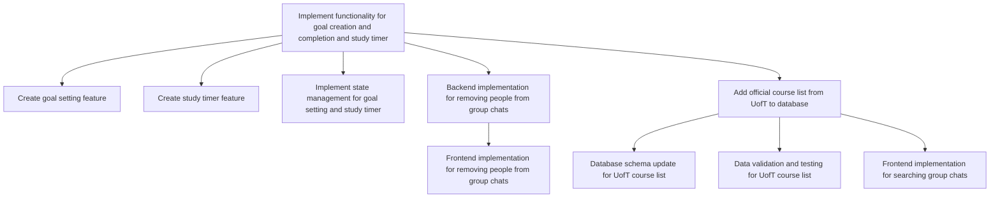

# Sprint Schedule

| Activity | Predecessor | Duration (days) |
|----------|-------------|-----------------|
| A        |             | 3               |
| B        | A           | 1               |
| C        | A           | 1               |
| D        | A           | 1               |
| E        | A           | 2               |
| F        | E           | 2               |
| G        | A           | 2               |
| H        | G           | 1               |
| I        | G           | 1               |
| J        | G           | 3               |

# Activity Descriptions

- **A**: `<KAN-46>`: Implement functionality for goal creation and completion and study timer
- **B**: `<KAN-46-1>`: Create goal setting feature
- **C**: `<KAN-46-2>`: Create study timer feature
- **D**: `<KAN-46-3>`: Implement state management for goal setting and study timer
- **E**: `<KAN-41-1>`: Backend implementation for removing people from group chats
- **F**: `<KAN-41-2>`: Frontend implementation for removing people from group chats
- **G**: `<KAN-137>`: Add official course list from UofT to database
- **H**: `<KAN-137-1>`: Database schema update for UofT course list
- **I**: `<KAN-137-2>`: Data validation and testing for UofT course list
- **J**: `<KAN-41-3>`: Frontend implementation for searching group chats

# Sprint Schedule Network Graph

The critical path includes all tasks that directly affect the project's completion time. To determine this, we need to look for the longest sequence of dependent tasks. Here’s the critical path identified:

A: Implement functionality for goal creation and completion and study timer (3 days)
G: Add official course list from UofT to database (2 days)
J: Frontend implementation for searching group chats (3 days)
The critical path is A -> G -> J, which totals 8 days.

graph TD
    A[Implement functionality for goal creation and completion and study timer]
    G[Add official course list from UofT to database]
    J[Frontend implementation for searching group chats]

    A --> G
    G --> J

# Work Habit Modifications

Based on the critical path analysis, our team has prioritized critical tasks (A, G, and J) to ensure timely completion by allocating additional support and resources to these tasks. We have also adopted parallel processing for non-critical tasks (B, C, D, E, F, H, and I) to maintain overall project progress without interfering with the critical path. Additionally, we increased the frequency of check-ins and stand-ups to monitor the progress of critical tasks closely and promptly address any blockers.

